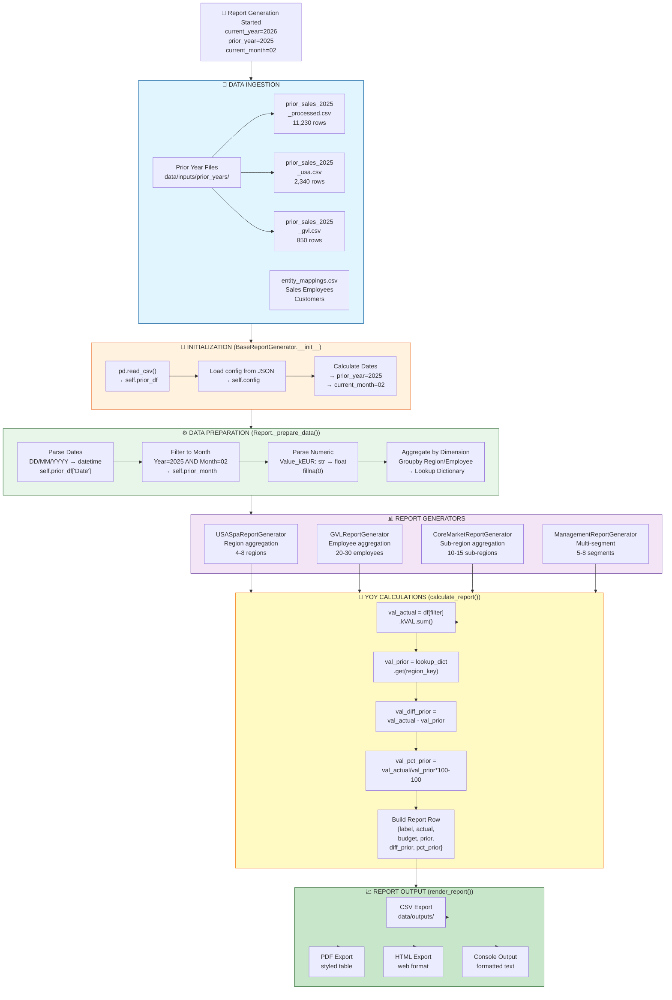
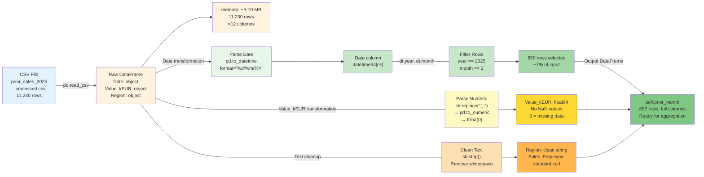
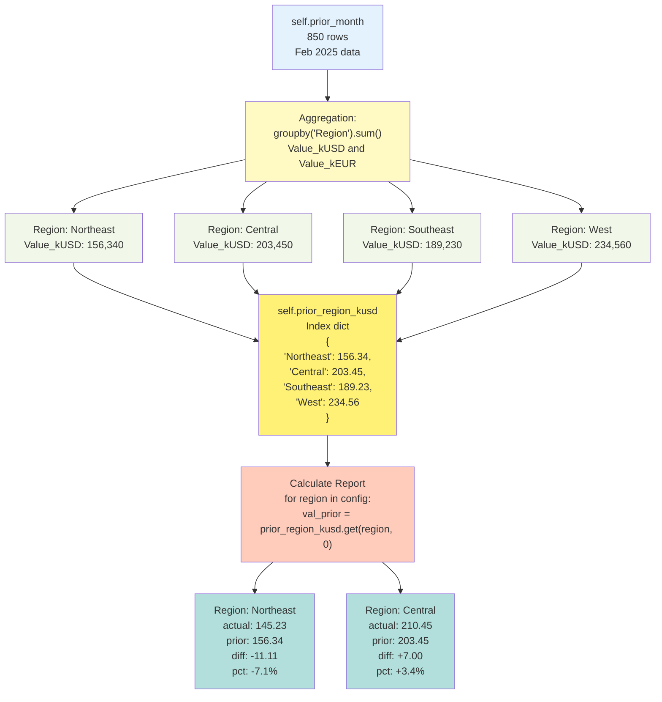
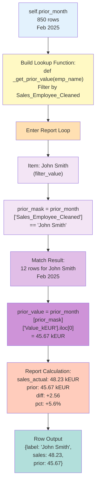
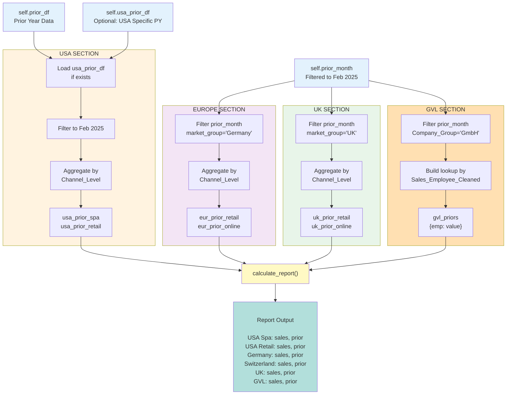
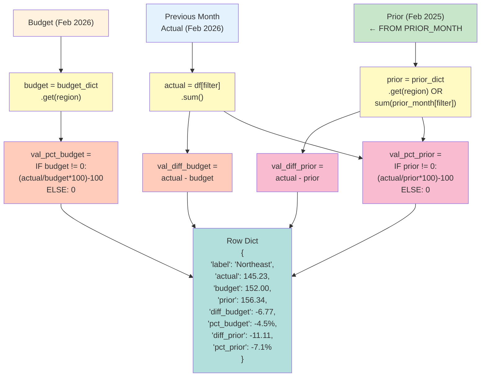
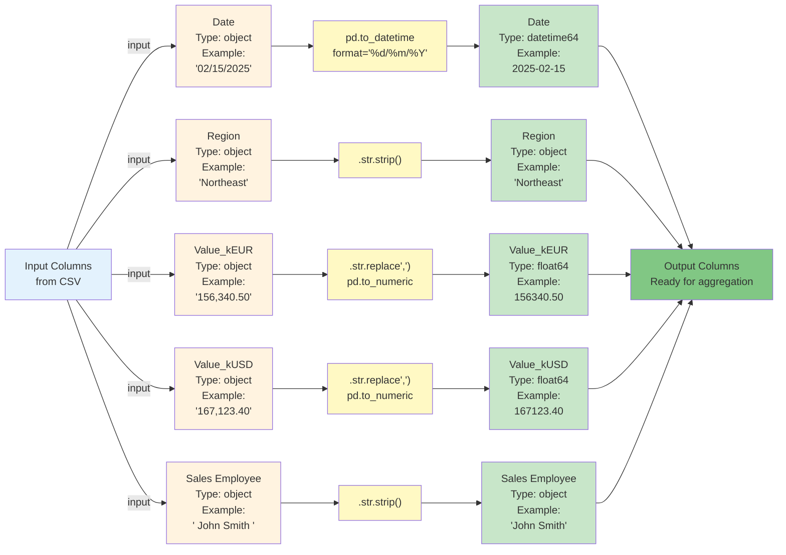
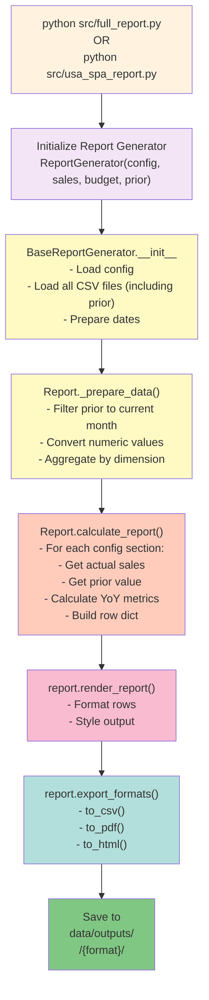
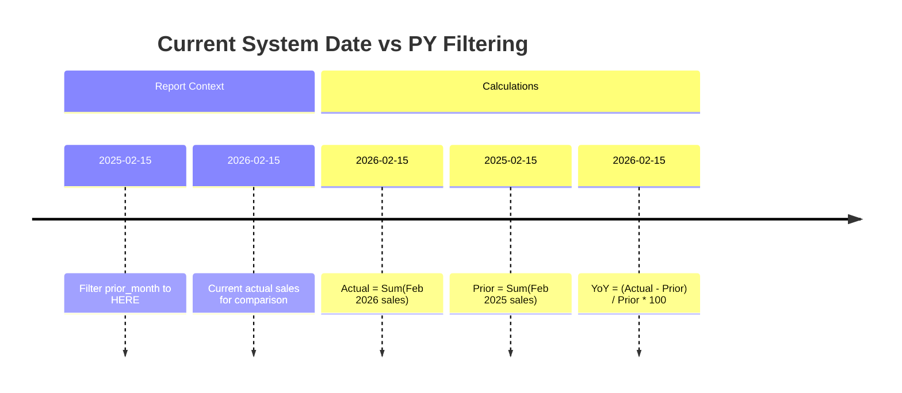

# Prior Year Data Flow - Detailed Architecture Diagrams
## sales_report_v2_independent

---

## 1. End-to-End Data Pipeline



---

## 2. Data Loading & Parsing Flow



---

## 3. Region-Level Aggregation (USA Spa Report)



---

## 4. Employee-Level Lookup (GVL Report)



---

## 5. Multi-Market Management Report Flow



---

## 6. YoY Calculation Pattern



---

## 7. Error Handling & Fallbacks

```mermaid
graph TD
    A["Load prior_df<br/>from CSV"]
    
    B{"File<br/>Exists?"}
    
    B1["⚠️ FileNotFoundError<br/>Exit with error"]
    
    C["Read CSV<br/>pd.read_csv()"]
    
    D{"CSV<br/>Valid?"}
    D1["⚠️ EmptyDataError<br/>Exit with error"]
    
    E["Parse Date<br/>pd.to_datetime<br/>format='%d/%m/%Y'"]
    
    F{"Parse<br/>Success?"}
    F1["Fallback:<br/>String prefix match<br/>startswith('2025-02')"]
    
    G["Filter Month<br/>year==2025<br/>month==2"]
    
    H["Convert Numeric<br/>pd.to_numeric<br/>errors='coerce'"]
    
    I["NaN Values?"]
    I1["Replace with 0<br/>.fillna(0)"]
    
    J["Group by Region<br/>sum()"]
    
    K{"Lookup<br/>Region?"]
    K1["Return 0<br/>.get(region, 0)"]
    
    L["YoY Calculation"]
    
    M{"Prior==0?"]
    M1["Set percent to 0<br/>if prior != 0"]
    
    N["Report Row"]
    
    A --> B
    B -->|No| B1
    B -->|Yes| C
    C --> D
    D -->|Empty| D1
    D -->|Valid| E
    E --> F
    F -->|Fail| F1
    F -->|Success| G
    F1 --> G
    G --> H
    H --> I
    I -->|NaN| I1
    I -->|Valid| J
    I1 --> J
    J --> K
    K -->|Not found| K1
    K -->|Found| L
    K1 --> L
    L --> M
    M -->|Yes| M1
    M -->|No| M1
    M1 --> N
    
    style A fill:#e3f2fd
    style B fill:#fff9c4
    style B1 fill:#ffcccc
    style C fill:#e8f5e9
    style D fill:#fff9c4
    style D1 fill:#ffcccc
    style E fill:#f3e5f5
    style F fill:#fff9c4
    style F1 fill:#ffe0b2
    style G fill:#c8e6c9
    style H fill:#fff9c4
    style I fill:#fff9c4
    style I1 fill:#ffe0b2
    style J fill:#ffccbc
    style K fill:#fff9c4
    style K1 fill:#ffe0b2
    style L fill:#b2dfdb
    style M fill:#fff9c4
    style M1 fill:#ffe0b2
    style N fill:#81c784
```

---

## 8. Data Column Transformations



---

## 9. Report Generation Command Flow



---

## 10. Timestamp & Date Context



---

**Document Version:** 1.0  
**Diagrams Created:** February 27, 2026  
**Tools:** Mermaid.js v10+
