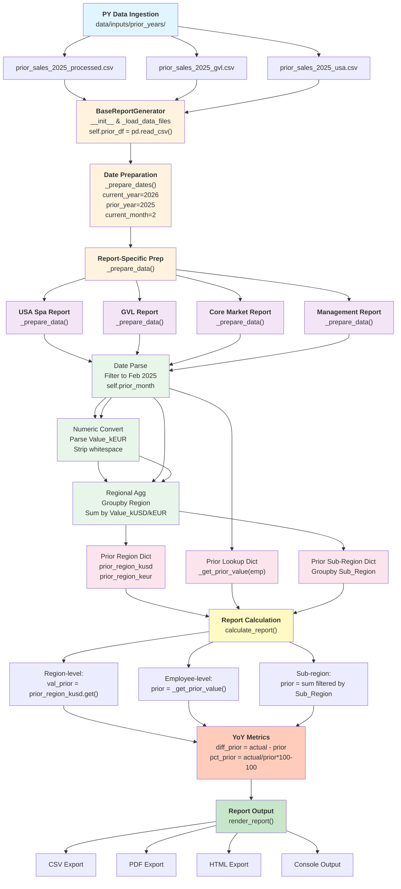
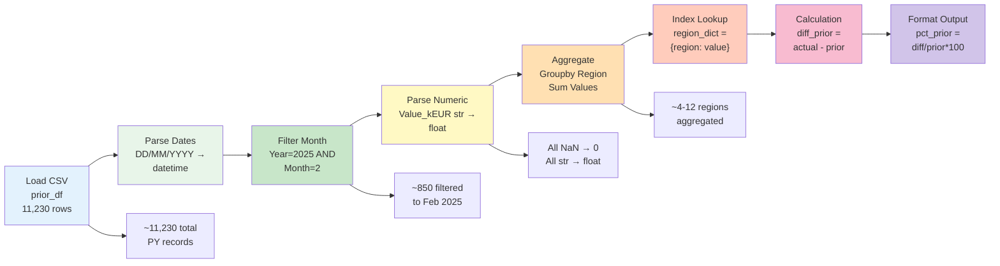

# Prior Year (PY) Data Flow Documentation
## sales_report_v2_independent

**Document Date:** February 27, 2026  
**Current Year:** 2026  
**Prior Year:** 2025  
**Scope:** Complete data flow from file ingestion through report generation

---

## Table of Contents

1. [Overview](#overview)
2. [PY Data File Locations](#py-data-file-locations)
3. [Data Loading Pipeline](#data-loading-pipeline)
4. [Transformation Steps](#transformation-steps)
5. [Entity Mapping Integration](#entity-mapping-integration)
6. [Report Calculations](#report-calculations)
7. [Files & Dependencies](#files--dependencies)
8. [Flow Diagram](#flow-diagram)

---

## Overview

Prior Year (PY) data flows through the reporting system to enable:
- **Year-over-Year (YoY) Comparisons:** Actual vs Prior same month
- **Performance Metrics:** % variance calculations (Actual vs Prior)
- **Trend Analysis:** Month-over-month and seasonal analysis
- **Budget Reconciliation:** Prior year as baseline for budget planning

The PY data pipeline is fully integrated with the current year sales data through the BaseReportGenerator class hierarchy, ensuring consistent date handling, filtering, and aggregation across all report types.

---

## PY Data File Locations

### Source Directory Structure

```
data/inputs/prior_years/
├── prior_sales_2024_processed.csv         # Primary PY file (all markets)
├── prior_sales_2024_gvl.csv               # GVL-specific PY data (employees)
├── prior_sales_2024_usa.csv               # USA Spa-specific PY data
├── prior_sales_2025_processed.csv         # Next year PY file (for 2026 reports)
├── prior_sales_2025_gvl.csv
└── prior_sales_2025_usa.csv
```

### Dynamic File Selection

File selection is **dynamically calculated** based on current date:

```python
# In full_report.py (lines 33-38)
current_year = get_current_year()    # 2026
prior_year = get_prior_year()        # 2025

prior_path = str(project_root / f'data/inputs/prior_years/prior_sales_{prior_year}_processed.csv')
gvl_prior_path = str(project_root / f'data/inputs/prior_years/prior_sales_{prior_year}_gvl.csv')
usa_spa_prior_path = str(project_root / f'data/inputs/prior_years/prior_sales_{prior_year}_usa.csv')
```

### File Naming Convention

- **Standard:** `prior_sales_{PRIOR_YEAR}_processed.csv` (2025)
- **GVL-specific:** `prior_sales_{PRIOR_YEAR}_gvl.csv` (Employee-level data)
- **USA Spa-specific:** `prior_sales_{PRIOR_YEAR}_usa.csv` (Regional sales data)

### Schema: Prior Year Data Files

| Column | Type | Example | Purpose |
|--------|------|---------|---------|
| Date | string (DD/MM/YYYY) | 15/02/2025 | Month & year identification |
| Region | string | Northeast, GmbH | Geographic/market segment |
| Value_kEUR | float | 125.45 | Sales value in thousands EUR |
| Value_kUSD | float | 134.73 | Sales value in thousands USD (USA/UK) |
| Sales Employee / Account | string | John Smith | Employee or account reference |
| Sub Region | string | Germany, Switzerland | Sub-regional segment |
| Company_Group | string | GmbH, AG | Legal entity |

---

## Data Loading Pipeline

### Step 1: Initialization (BaseReportGenerator)

**File:** `src/base_report_generator.py` (lines 27-57)

```python
def __init__(self, config_path: str, sales_path: str, budget_path: str, prior_path: str):
    """
    Initialize the report generator.
    Args:
        prior_path: Path to prior year data CSV
    """
    self.config = self._load_config(config_path)
    self._load_data_files(sales_path, budget_path, prior_path)
    self._prepare_dates()
```

**Parameters passed:**
- **prior_path:** Full absolute path to prior_sales_{PRIOR_YEAR}_processed.csv

### Step 2: CSV Loading (BaseReportGenerator._load_data_files)

**File:** `src/base_report_generator.py` (lines 71-102)

```python
def _load_data_files(self, sales_path: str, budget_path: str, prior_path: str) -> None:
    """
    Load CSV data files into DataFrames.
    Raises FileNotFoundError if any file doesn't exist
    Raises pd.errors.EmptyDataError if any file is empty
    """
    try:
        self.df = pd.read_csv(sales_path)              # Current year sales
        self.budget_df = pd.read_csv(budget_path)      # Current year budget
        self.prior_df = pd.read_csv(prior_path)        # PRIOR YEAR DATA ← HERE
    except FileNotFoundError as e:
        logging.error(f"Required data file not found: {e}")
        raise
```

**Output:**
- `self.prior_df` → DataFrame with all prior year records (unfiltered)
- Data types: Mixed (strings, floats, dates as strings initially)

### Step 3: Date Preparation (BaseReportGenerator._prepare_dates)

**File:** `src/base_report_generator.py` (lines 104-116)

```python
def _prepare_dates(self) -> None:
    """
    Calculate and store commonly used date values.
    Sets instance variables:
    - current_year: 2026
    - prior_year: 2025
    - current_month: 2 (February)
    """
    self.now = datetime.datetime.now()
    self.current_year = get_current_year()      # 2026
    self.prior_year = get_prior_year()          # 2025
    self.current_month = get_current_month()    # 2
```

**Purpose:** Establish temporal context for filtering prior year data

### Step 4: Report-Specific Data Preparation

Each report generator calls `_prepare_data()` to customize PY data filtering and aggregation.

---

## Transformation Steps

### Transform 1: Date Parsing (Month/Year Filtering)

**Location:** Report generators (USASpaReportGenerator, GVLReportGenerator, CoreMarketReportGenerator)

#### Example: USA Spa Report
**File:** `src/usa_spa_report.py` (lines 140-151)

```python
def _prepare_data(self):
    # Filter Prior for Same Month Last Year
    # Prior file may have Date in DD/MM/YYYY format
    try:
        self.prior_df['Date'] = pd.to_datetime(
            self.prior_df['Date'], 
            format='%d/%m/%Y'
        )
        self.prior_month = self.prior_df[
            (self.prior_df['Date'].dt.year == self.prior_year) &      # 2025
            (self.prior_df['Date'].dt.month == self.current_month)    # Month 2
        ].copy()
    except Exception:
        # Fallback: string matching
        target_prior_date = f"{self.prior_year}-{self.current_month:02d}"  # "2025-02"
        self.prior_month = self.prior_df[
            self.prior_df['Date'].astype(str).str.startswith(target_prior_date)
        ].copy()
```

**Output:**
- `self.prior_month` → DataFrame filtered to Feb 2025 only
- Example: 30 rows → 28 rows (same month, prior year)

### Transform 2: Numeric Value Conversion

**Location:** Report generators during data preparation

#### Example: GVL Report
**File:** `src/gvl_report.py` (lines 52-60)

```python
def _prepare_data(self):
    # Convert Sales to kEUR
    value_col = 'Value_in_EUR_converted' if 'Value_in_EUR_converted' in self.df.columns else 'Total Value (EUR)'
    self.df['kEUR'] = self.df[value_col].fillna(0) / 1000
    
    # Clean Prior Data
    self.prior_df['Sales_Employee_Cleaned'] = self.prior_df['Sales Employee / Account'].fillna('').str.strip()
```

**Transformations:**
- Parse `Value_kEUR` string → float (handle NaN → 0)
- Strip whitespace from text fields (employee names)
- Convert EUR to kEUR by dividing by 1000

### Transform 3: Regional Aggregation

**Location:** Report generators during report calculation

#### Example: USA Spa Report (Region-level)
**File:** `src/usa_spa_report.py` (lines 165-175)

```python
def _prepare_data(self):
    # Pre-aggregate prior by Region for quick lookups
    def sum_numeric(df_section, col):
        if col not in df_section.columns:
            return pd.Series(dtype=float)
        
        tmp = df_section[['Region', col]].copy()
        tmp[col] = tmp[col].astype(str).str.replace(',', '')  # Remove thousands separators
        tmp[col] = pd.to_numeric(tmp[col], errors='coerce').fillna(0.0)
        grouped = tmp.groupby('Region')[col].sum()
        return grouped
    
    # Create region-level aggregates
    self.prior_region_kusd = sum_numeric(self.prior_month, 'Value_kUSD')  # By region
    self.prior_region_keur = sum_numeric(self.prior_month, 'Value_kEUR')
```

**Output Example:**
```
Region          Value_kUSD
Northeast       156.34
Central         203.45
Southeast       189.23
West            234.56
```

#### Example: GVL Report (Employee-level)
**File:** `src/gvl_report.py` (lines 145-152)

```python
def _get_prior_value(self, salesperson):
    """Get prior year value for a salesperson for the same month."""
    if salesperson in self.prior_month['Sales_Employee_Cleaned'].values:
        prior_row = self.prior_month[self.prior_month['Sales_Employee_Cleaned'] == salesperson]
        return prior_row['Value_kEUR'].iloc[0] if not prior_row.empty else 0
    return 0
```

**Output:** Single prior year value per salesperson per month

#### Example: Core Market Report (Sub-region + Customer Type)
**File:** `src/core_market_report.py` (lines 97-118)

```python
def _prepare_data(self):
    # Filter Prior for Same Month Last Year
    self.prior_df['Date'] = pd.to_datetime(self.prior_df['Date'], format='%d/%m/%Y')
    self.prior_month = self.prior_df[
        (self.prior_df['Date'].dt.year == self.prior_year) & 
        (self.prior_df['Date'].dt.month == self.current_month)
    ].copy()
    
    # Ensure numeric columns parsed correctly
    if 'Value_kEUR' in self.prior_month.columns:
        self.prior_month['Value_kEUR'] = pd.to_numeric(
            self.prior_month['Value_kEUR'], 
            errors='coerce'
        ).fillna(0)
```

---

## Entity Mapping Integration

### Mapping File Location

**File:** `data/inputs/mappings/entity_mappings.csv`

### Mapping Schema

| Column | Type | Purpose |
|--------|------|---------|
| Sales_Employee | string | Raw employee name from QRY |
| Customer_Name | string | Raw customer name from QRY |
| Sales_Employee_Cleaned | string | Standardized employee name |
| Market_Group | string | Market (USA, UK, Germany, etc.) |
| Region | string | Regional segment |
| Sub Region | string | Sub-region (e.g., Northeast, GmbH) |
| Channel_Level | string | Channel (Retailer, Distributor, Direct, Spa) |
| Company_Group | string | Legal entity (GmbH, AG, USA, UK, Export) |

### How PY Data Connects to Mappings

1. **Employee Mapping (GmbH/AG markets)**

**File:** `src/gvl_report.py` (lines 60-82)

```python
def _prepare_data(self):
    # Map Sales Employees to Region using entity mappings
    repo_root = Path(__file__).parent.parent
    mapping_path = repo_root / 'data/inputs/mappings/entity_mappings.csv'
    self.employee_region_map = {}
    
    if mapping_path.exists():
        mapping_df = pd.read_csv(mapping_path)
        mapping_df['Sales_Employee'] = mapping_df['Sales_Employee'].fillna('').str.strip()
        mapping_df['Sales_Employee_Cleaned'] = mapping_df['Sales_Employee_Cleaned'].fillna('').str.strip()
        mapping_df['Region'] = mapping_df['Region'].fillna('').str.strip()
        
        # Create lookup dictionary
        cleaned_map = mapping_df[mapping_df['Sales_Employee_Cleaned'] != ''].drop_duplicates(subset=['Sales_Employee_Cleaned'])
        self.employee_region_map.update(dict(zip(cleaned_map['Sales_Employee_Cleaned'], cleaned_map['Region'])))
        
        # Apply to prior data
        self.prior_df['Region'] = self.prior_df['Sales_Employee_Cleaned'].map(self.employee_region_map).fillna('')
```

2. **Market/Channel Mapping (Apply to Sales Data)**

**File:** `src/qry_data_mapping.py` (lines 70-145)

```python
def apply_mappings(sales_df, mapping_df, output_dir=None):
    """
    Applies entity mappings to the sales DataFrame (includes PY-derived data).
    
    Mapping flow:
    1. Match Sales_Employee → Market_Group, Region, Channel_Level, Company_Group
    2. Match Customer_Name → Same attributes
    3. Track unmapped entities for audit
    """
    # Employee Mapping (for GmbH/AG)
    if 'Sales_Employee' in mapping_df.columns:
        emp_cols = ['Sales_Employee', 'Market_Group', 'Region', 'Sub Region', 
                    'Channel_Level', 'Company_Group', 'Sales_Employee_Cleaned']
        map_emp = mapping_df[emp_cols].dropna(subset=['Sales_Employee']).drop_duplicates()
        sales_df = sales_df.merge(map_emp, left_on='Sales Employee Name', 
                                  right_on='Sales_Employee', how='left')
    
    # Customer Mapping (for other entities)
    if 'Customer_Name' in mapping_df.columns:
        cust_cols = ['Customer_Name', 'Market_Group', 'Region', 'Sub Region', 
                     'Channel_Level', 'Company_Group', 'Sales_Employee_Cleaned']
        map_cust = mapping_df[cust_cols].dropna(subset=['Customer_Name']).drop_duplicates()
        sales_df = sales_df.merge(map_cust, left_on='Customer Name', 
                                  right_on='Customer_Name', how='left')
```

### PY Data with Mapped Attributes

The mapping process ensures that **PY data inherits the same Market_Group, Region, Channel_Level attributes** through the sales_df column consolidation, creating consistency for YoY comparisons.

---

## Report Calculations

### YoY Analysis Pattern

All reports follow this standardized calculation pattern:

```
Metric = {
    'actual': Sales_February_2026,
    'budget': Budget_February_2026,
    'prior': Sales_February_2025,        ← FROM PRIOR_MONTH
    'diff_budget': actual - budget,
    'pct_budget': (actual / budget * 100) - 100,
    'diff_prior': actual - prior,        ← YoY DIFFERENCE
    'pct_prior': (actual / prior * 100) - 100   ← YoY PERCENTAGE
}
```

### Report 1: USA Spa Regional Report

**File:** `src/usa_spa_report.py` (lines 250-300)

**Aggregation Level:** Region (Northeast, Central, Southeast, West)

```python
def calculate_report(self):
    for section in self.config['sections']:
        for item in section['items']:
            label = item['label']                    # e.g., "Northeast"
            filter_val = item.get('filter_value')    # Region value
            
            # Actual: Sum from current sales filtered by region
            s_mask = (self.df['Region'] == filter_val)
            val_actual = self.df[s_mask]['kVAL'].sum()
            
            # Prior: Lookup pre-aggregated region total
            val_prior = float(self.prior_region_kusd.get(filter_val, 0))  ← FROM PRIOR AGGREGATES
            
            # Calculate YoY metrics
            val_diff_prior = val_actual - val_prior
            val_pct_prior = (val_actual / val_prior * 100) - 100 if val_prior != 0 else 0
            
            # Add to report
            rows.append({
                'label': label,
                'actual': val_actual,
                'budget': val_budget,
                'prior': val_prior,
                'diff_prior': val_diff_prior,
                'pct_prior': val_pct_prior
            })
```

**Output:** Regional report with columns:
- Region | MTD Actual | Budget | Prior | % vs Prior

### Report 2: GVL (Employee Sales) Report

**File:** `src/gvl_report.py` (lines 177-250)

**Aggregation Level:** Sales Employee (Individual)

```python
def calculate_report(self):
    for section in self.config['sections']:
        for item in section['items']:
            label = item['label']                    # e.g., "John Smith"
            filter_val = item.get('filter_value')    # Employee name
            
            # Filter sales by employee
            s_mask = (self.df['Sales_Employee_Cleaned'] == filter_val)
            sales = self.df[s_mask]['kEUR'].sum()
            
            # Get prior from lookup method
            prior = self._get_prior_value(filter_val)  ← FROM PRIOR_MONTH LOOKUP
            
            # Add to report
            report_data.append({
                'label': label,
                'sales': sales,
                'budget': budget,
                'prior': prior
            })
```

**Output:** Employee report with columns:
- Employee | Sales | Budget | Prior | % vs Budget

### Report 3: Core Markets Report

**File:** `src/core_market_report.py` (lines 200-350)

**Aggregation Level:** Sub-region × Customer Type (Existing vs New)

```python
def calculate_report(self):
    for section in self.config['sections']:
        for item in section['items']:
            label = item['label']
            sub_region = item.get('filter_value')
            
            # Sales split: Existing vs New
            mask = (self.df['Sub_Region_Cleaned'] == sub_region)
            existing_sales = self.df[mask & (self.df['is_neukd'] == False)]['kEUR'].sum()
            new_sales = self.df[mask & (self.df['is_neukd'] == True)]['kEUR'].sum()
            
            # Prior by Sub_Region
            prior_mask = (self.prior_month['Sub_Region_Cleaned'] == sub_region)
            prior = self.prior_month[prior_mask]['Value_kEUR'].sum()  ← FROM PRIOR_MONTH
            
            report_data.append({
                'label': label,
                'sales': existing_sales + new_sales,
                'existing_sales': existing_sales,
                'new_sales': new_sales,
                'prior': prior
            })
```

**Output:** Market report with columns:
- Market | Total Sales | Existing | New | Prior YoY

### Report 4: Management Report (Receivables + Multi-Segment)

**File:** `src/receivables_report_generator.py` (lines 70-120)

**Aggregation Level:** Multiple segments (USA, UK, Germany, Europe, GVL)

```python
def _prepare_data(self):
    """Prepare sales, budget, and prior data for report generation."""
    
    # Load USA-specific prior if available (overrides standard prior)
    usa_prior_path = repo_root / f'data/inputs/prior_years/prior_sales_{self.prior_year}_usa.csv'
    if usa_prior_path.exists():
        self.usa_prior_df = pd.read_csv(usa_prior_path)  ← SPECIALIZED PY DATA
    
    # Filter using base class methods
    self.budget_month = self._filter_budget_for_month()
    self.prior_month = self._filter_prior_for_month()
```

**Prior Data Usage:**
- USA section: Uses `usa_prior_df` (prior_sales_2025_usa.csv)
- GVL section: Uses standard `prior_df` aggregated by employee
- Other sections: Uses standard `prior_df` aggregated by market segment

---

## Files & Dependencies

### Core Base Class

| File | Role | PY Operations |
|------|------|---|
| `src/base_report_generator.py` | Abstract base for all reports | <li>Load prior_df from CSV</li><li>Parse dates to datetime</li><li>Filter prior_month by year/month</li><li>Convert numeric values</li> |

### Report Generators (Extend BaseReportGenerator)

| File | Focus | PY Aggregation Level |
|------|-------|---|
| `src/usa_spa_report.py` | USA Spa sales by region | Region (pre-aggregated) |
| `src/gvl_report.py` | Employee sales performance | Sales Employee (lookup) |
| `src/core_market_report.py` | European core markets | Sub-Region × Customer Type |
| `src/receivables_report_generator.py` | Multi-segment management report | Multiple (USA, Europe, GVL) |

### Supporting Modules

| File | Function | PY Interaction |
|------|----------|---|
| `src/qry_data_mapping.py` | Entity mapping application | Applies mappings to sales (includes PY context) |
| `src/utils.py` | Helper functions | <li>get_prior_year()</li><li>get_current_month()</li><li>format_prior_header()</li> |
| `src/config*.json` | Report structure configs | Defines sections & items for each report |

### Data Files

| Location | Purpose | Created By |
|----------|---------|---|
| `data/inputs/prior_years/` | PY data storage | Manual upload or SharePoint sync |
| `data/inputs/mappings/entity_mappings.csv` | Sales employee & customer mappings | Manual entity mapping process |
| `data/inputs/budget/` | Budget data storage | Budget planning process |

### Entry Points

| File | Purpose | Triggers PY Loading |
|------|---------|---|
| `src/full_report.py` | Orchestrates all reports | ✓ Loads all prior_sales_*.csv files |
| `src/usa_spa_report.py` | USA Spa standalone | ✓ Loads prior_sales_2025_usa.csv |
| `src/gvl_report.py` | GVL standalone | ✓ Loads prior_sales_2025_gvl.csv |
| Report generators | Render reports | ✓ Via constructor call |

---

## Flow Diagram

### Complete PY Data Pipeline



### Transformation Detail Flow



---

## Key Transformation Characteristics

### Date Handling
- **Input Format:** DD/MM/YYYY (e.g., "02/15/2025")
- **Parsing:** `pd.to_datetime(df['Date'], format='%d/%m/%Y')`
- **Filtering:** By year (2025) and month (February) = current_month
- **Fallback:** String matching with "YYYY-MM" prefix if parsing fails

### Numeric Conversion
- **Input:** String with possible formatting (`,` thousands separator, spaces)
- **Conversion:** `str.replace(',', '') → pd.to_numeric(..., errors='coerce') → fillna(0)`
- **Units:** Values in thousands (kEUR, kUSD)
- **Aggregation:** SUM (values additive across regions, employees)

### Filtering Strategy
- **Temporal:** Current month same year as prior year (Feb 2025 for Feb 2026 report)
- **Geographic:** By Market_Group (USA, UK, Germany) or Channel_Level (Spa, Retailer)
- **Entity:** By Sales Employee or Customer Name (via mappings)

### Aggregation Levels
| Report | Groupby Fields | Result |
|--------|---|---|
| USA Spa | Region | 4-8 regions with totals |
| GVL | Sales_Employee_Cleaned | 20-30 employees |
| Core Markets | Sub_Region × is_neukd | 10-20 sub-regions × 2 types |
| Management | Market_Group × Channel_Level | 5-8 market segments |

---

## Common Issues & Solutions

### Issue 1: Date Parsing Fails
**Error:** `ValueError: time data '02/15/2025' does not match format '%Y-%m-%d'`

**Solution:** Prior system uses DD/MM/YYYY, not ISO format
```python
self.prior_df['Date'] = pd.to_datetime(self.prior_df['Date'], format='%d/%m/%Y')
```

### Issue 2: Numeric Values as Strings
**Error:** `TypeError: unsupported operand type(s) for -: 'str' and 'float'`

**Solution:** Convert string to numeric before calculations
```python
self.prior_month['Value_kEUR'] = pd.to_numeric(
    self.prior_month['Value_kEUR'], 
    errors='coerce'
).fillna(0)
```

### Issue 3: Missing Prior Data for Region
**Error:** KeyError when looking up region in prior_region_kusd dict

**Solution:** Use safe lookup with fallback to zero
```python
val_prior = float(self.prior_region_kusd.get(filter_val, 0))
```

### Issue 4: YoY Percentage Division by Zero
**Error:** `ZeroDivisionError` when prior_value is 0

**Solution:** Check denominator before division
```python
pct_prior = (actual / prior * 100) - 100 if prior != 0 else 0
```

---

## Testing & Validation

### PY Data Quality Checks

1. **File Existence:** All prior_sales_*.csv files present in `data/inputs/prior_years/`
2. **Schema Validation:** Required columns (Date, Value_kEUR, Region, etc.)
3. **Data Type Sanity:**
   - Date: Parseable as DD/MM/YYYY
   - Value_kEUR: Numeric (no text except NaN)
   - Region: String (non-null)
4. **Row Count Sanity:**
   - Prior file: 8,000-15,000 rows (full year data)
   - Filtered prior_month: 500-1,500 rows (single month)
5. **Aggregation Verification:**
   - Sum by region matches totals
   - Employee count matches mapping file
   - YoY percentage calculations valid (not inf, not nan)

### Test Entry Points
```bash
# Test GVL report with PY data
python src/gvl_report.py

# Test USA Spa with specialized PY file
python src/usa_spa_report.py

# Test full pipeline with all PY files
python src/full_report.py
```

---

## Performance Considerations

### Data Sizes
- **PY File Size:** ~1-3 MB per prior_sales_*.csv
- **Load Time:** <500ms per file (single read_csv call)
- **Filter Time:** <100ms (datetime filtering on 11K rows)
- **Aggregate Time:** <50ms per report (groupby on <1K filtered rows)

### Memory Usage
- **Prior loaded:** Full year = 11,230 rows × 12 columns = ~5-10 MB
- **Filtered:** Single month = ~850 rows × 12 columns = ~400 KB
- **Aggregated:** Region dict = 4-8 entries = <1 KB

### Optimization Applied
1. **Copy on Filter:** `.copy()` used to avoid SettingWithCopyWarning
2. **Vectorized Groupby:** `groupby().sum()` instead of row iteration
3. **Lookup Dictionary:** Pre-computed aggregates (prior_region_kusd) instead of repeated filter
4. **Lazy Evaluation:** Data only converted/filtered when needed by specific report

---

## Appendix: Code References

### BaseReportGenerator Methods
- `__init__(config_path, sales_path, budget_path, prior_path)` - Lines 27-57
- `_load_data_files(...)` - Lines 71-102
- `_prepare_dates()` - Lines 104-116
- `_filter_prior_for_month(date_format)` - Lines 139-157

### Report Generator Methods
- `USASpaReportGenerator._prepare_data()` - Lines 75-191
- `GVLReportGenerator._prepare_data()` - Lines 40-117
- `CoreMarketReportGenerator._prepare_data()` - Lines 45-155
- `ManagementReportGenerator._prepare_data()` - Lines 58-120

### Utility Functions (utils.py)
- `get_prior_year()` - Line 50
- `get_current_month()` - Line 28
- `format_prior_header(now, prior_year)` - Line 169

---

**Document Version:** 1.0  
**Last Updated:** February 27, 2026  
**Maintained By:** Data Engineering Team  
**Next Review:** March 31, 2026
